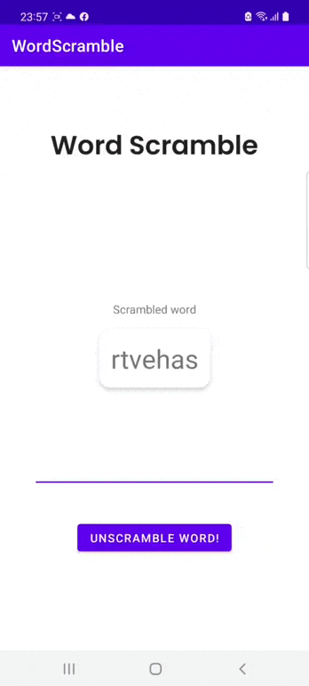

# Лабораторна робота 1. Створення макета, взаємодія з елементами UI

## Завдання 1. Розробити вітальну листівку з днем народження.

Листівка має містити гарний текст, фоновий колір і зображення.
Приклад листівки

  

## Завдання 2. Розробити гру Word Scramble

Суть гри полягає в такому:

1. Комп'ютер обирає випадкове слово зі списку слів, перемішує літери в цьому слові і показує гравцеві.
2) Гравець повинен здогадатися - яке слово вибрав комп'ютер і ввести його в поле введення.
3) Якщо гравець вгадав слово - гра починається заново.
4. Якщо слово невірне, комп'ютер повідомляє гравця про це і гра триває.
Гра може виглядати приблизно так

  

